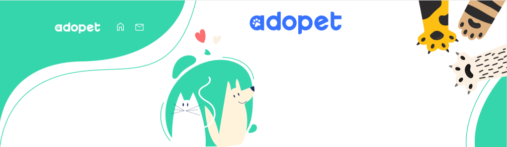
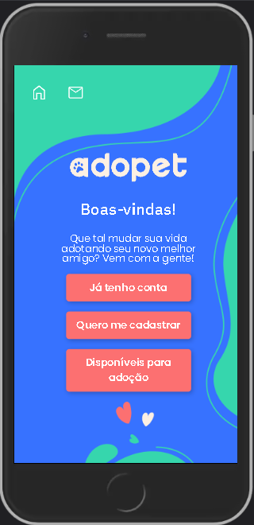
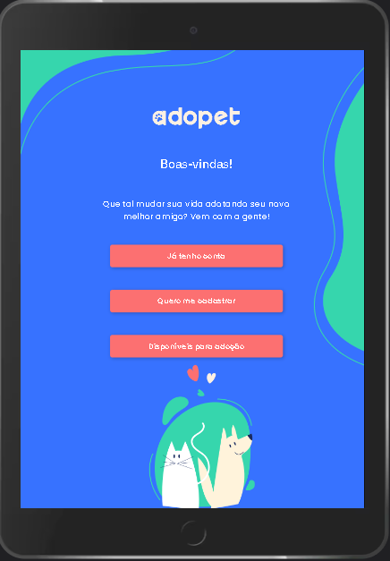
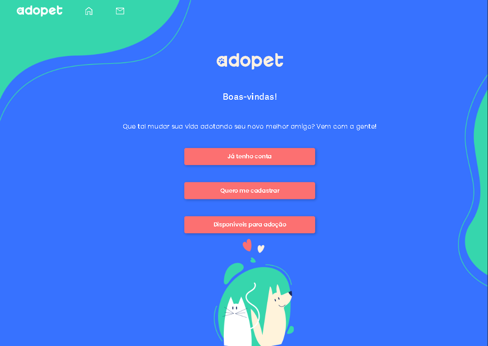

<h1 align='center'></h1>
 
 

 

<h3 align="center">
	🚧  Adopet 🚀 Finalizado  🚧
</h3>

 
 

 <a href="#Descrição">Descrição</a> •
 <a href="#Requisitos">Requisitos</a> •
 <a href="#tecnologias">Tecnologias</a> •
 <a href="#responsivo">Responsivo</a> •
 <a href="#autor">Autor</a>

## Descrição

A empresa AdoPet têm como objetivo fazer o intermédio entre adotantes de animais e ONGs que possuem foco de retirar animais da rua. Visando isso, ela precisa trazer mais usuários e aumentar a interação entre possíveis adotantes e representantes dessas ONGs e para isso, deseja implementar uma plataforma e levar a empresa pro mundo digital.

 
 

## Requisitos

- Uma página inicial que será de login, contendo os botões de "já tenho conta" e "quero me cadastrar".
- Uma página de cadastro que terá um formulário solicitando as informações: nome, e-mail e senha.
- Uma página de login com um formulário de e-mail e senha.
- Uma página que deve aparecer após o login com uma lista de cachorros e gatos. Cada animal deve mostrar foto, nome, idade, porte, características e região. Para cada animal haverá um botão de contato.
- Uma página de edição de envio de mensagem, com um formulário com campos de nome, telefone, nome do animal e mensagem.
- Permitir a edição do perfil, onde também será possível incluir foto do usuário.

 
 

## 🛠 Tecnologias

As seguintes tecnlogias foram usadas na construção do projeto:

- HTML
	- Meta tags de SEO
	- Pattern (Validação de formulários)
	- Tag Semanticas

- CSS3
	- Flexbox
	- Mobile Fisrt
	- Padrão BEM

- JAVASCRIPT VANILLA
	- Regex
	- Validity
		- Validity State
	- Manipulação do DOM

- NODE.JS
- PRETTIER
- ESLINT
- YARYN
- GIT
	- Padrões de commits
	- Uso de branch
	- Comandos do terminal
- GITHUB

 
 

## Tarefas Pendentes

- [ ] Tags de SEO
- [ ] Permitir a edição do usuário criado e a inserção de imagem.
- [ ] Tela de animais: listagem dinâmica - API
- [ ] Utilizar uma ferramenta SPA (Feito apenas com JS, CSS, HTML)

## Tarefas Concluídas
- [X] Tela de contato: validar dados
- [X] Tela de login: validar e-mail
- [X] Tela de cadastro: cadastro funcional
- [X] Tela de cadastro: validar e-mail
- [X] Responsividade

## Responsividade

 O projeto foi desenvolvido para se adaptar a diferentes tipos de tela.
 
 
 
 

 
 

 
 

 
 
 
 
 
 

## Autor

 

<a href="https://github.com/devguimaraes" align='center'>  
<b>Bruno Guimaraães</b>
</a> 

